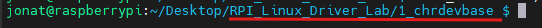
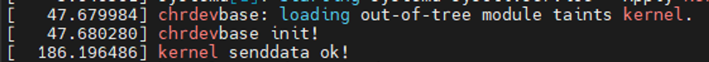

# 1. 字符設備驅動(實作)  (本實作參考[正點原子範例!](https://space.bilibili.com/394620890)，直接執行在樹莓派上。)

# 1. chrdevbase字元裝置驅動開發實驗

字元設備驅動開發的基本步驟我們已經了解了，本節我們就以 `chrdevbase`這個虛擬設備為 例，完整的編寫一個字元設備驅動模組。 

chrdevbase不是實際存在的一個設備，是筆者為了方便講解字符設備的開發而引入的一個虛擬設備。

 chrdevbase裝置有兩個緩衝區，一個為讀取緩衝區，一個為寫入緩衝區，這兩個緩衝區的大小都是 100位元組。在應用程式中可以向 chrdevbase設 備的寫入緩衝區中寫入數據，從讀取緩衝區讀取數據。 chrdevbase這個虛擬裝置的功能很簡單， 但它包含了字元裝置最基本的功能。

# 樹莓派實作chrdevbase程序編寫:

      應用程式呼叫 `open`函數打開 chrdevbase這個設備，打開以後可以使用 `write`函數向chrdevbase的寫入緩衝區 `writebuf`寫入資料 (不超過 100個位元組 )，也可以使用 `read`函數讀取讀緩衝區 `readbuf`中的資料操作，操作完成以後應用程式使 用 `close`函數關閉 chrdevbase裝置。

## 1. 創建 VSCode工程

      在 RPI 中建立一個目錄用來存放 Linux驅動程序，例如我創建了一個名為 Linux_Drivers的目錄來存放所有的 Linux驅動程式。在 Linux_Drivers目錄下新建一個名為 1_chrdevbase的子目錄來存放本實驗所有文件，如圖 40.4.1.1



圖 40.4.1.1

在 1_chrdevbase目錄中新建 VSCode工程，並且新建 `chrdevbase.c`和文件，完成以後 1_chrdevbase目錄中的文件如圖 40.4.1.2


## 2. 添加頭文件路徑:

      因為是編寫 Linux驅動，因此會用到 Linux原始碼中的函數。我們需要在 VSCode中新增 Linux原始碼中的頭檔路徑。開啟 VSCode，按下 Crtl+Shift+P」開啟 VSCode的控制台，然後輸入C/C++: Edit configurations(JSON) ”，開啟 C/C++編輯設定文件，如圖 40.4.1.3所示：


開啟以後會自動在 .vscode目錄下產生一個名為 c_cpp_properties.json的文件。原本為圖中所示:


第 5行的 includePath表示頭檔路徑，需要將 Linux原始碼裡面的頭檔路徑加入進來，**也就是我們前面移植的 Linux源碼中的頭檔路徑**。新增頭檔路徑以後的 c_cpp_properties.json的檔案內容如下所示：


## 3. 編寫實驗程序

工程建立好以後就可以開始寫驅動程式了，新建 `chrdevbase.c`，然後在裡面輸入以下內容

```c
#include <linux/types.h>      // 定義了內核中使用的基本數據類型，幾乎所有內核版本都包含此文件。
#include <linux/kernel.h>     // 包含了一些核心的內核函數和宏定義，也是非常基礎的頭文件。
#include <linux/delay.h>      // 提供了一些延遲函數，在大多數內核配置中都會包含。
//#include <linux/ide.h>        // 樹梅派沒有ide接口
#include <linux/init.h>       // 包含了模塊初始化和退出相關的宏，是很常見的頭文件
#include <linux/module.h>     // 用於內核模塊編程，在支持可加載模塊的內核中都會存在。

#define CHRDEVBASE_MAJOR	200				/* 主设备号 */
#define CHRDEVBASE_NAME		"chrdevbase" 	/* 设备名     */

static char readbuf[100];		/* 读缓冲区 */
static char writebuf[100];		/* 写缓冲区 */
static char kerneldata[] = {"kernel data!"};

/*
 * @description		: 打开设备
 * @param - inode 	: 传递给驱动的inode
 * @param - filp 	: 设备文件，file结构体有个叫做private_data的成员变量
 * 					  一般在open的时候将private_data指向设备结构体。
 * @return 			: 0 成功;其他 失败
 */
static int chrdevbase_open(struct inode *inode, struct file *filp)
{
	//printk("chrdevbase open!\r\n");
	return 0;
}

/*
 * @description		: 从设备读取数据 
 * @param - filp 	: 要打开的设备文件(文件描述符)
 * @param - buf 	: 返回给用户空间的数据缓冲区
 * @param - cnt 	: 要读取的数据长度
 * @param - offt 	: 相对于文件首地址的偏移
 * @return 			: 读取的字节数，如果为负值，表示读取失败
 */
static ssize_t chrdevbase_read(struct file *filp, char __user *buf, size_t cnt, loff_t *offt)
{
	int retvalue = 0;
	
	/* 向用户空间发送数据 */
	memcpy(readbuf, kerneldata, sizeof(kerneldata));
	retvalue = copy_to_user(buf, readbuf, cnt);
	if(retvalue == 0){
		printk("kernel senddata ok!\r\n");
	}else{
		printk("kernel senddata failed!\r\n");
	}
	
	//printk("chrdevbase read!\r\n");
	return 0;
}

/*
 * @description		: 向设备写数据 
 * @param - filp 	: 设备文件，表示打开的文件描述符
 * @param - buf 	: 要写给设备写入的数据
 * @param - cnt 	: 要写入的数据长度
 * @param - offt 	: 相对于文件首地址的偏移
 * @return 			: 写入的字节数，如果为负值，表示写入失败
 */
static ssize_t chrdevbase_write(struct file *filp, const char __user *buf, size_t cnt, loff_t *offt)
{
	int retvalue = 0;
	/* 接收用户空间传递给内核的数据并且打印出来 */
	retvalue = copy_from_user(writebuf, buf, cnt);
	if(retvalue == 0){
		printk("kernel recevdata:%s\r\n", writebuf);
	}else{
		printk("kernel recevdata failed!\r\n");
	}
	
	//printk("chrdevbase write!\r\n");
	return 0;
}

/*
 * @description		: 关闭/释放设备
 * @param - filp 	: 要关闭的设备文件(文件描述符)
 * @return 			: 0 成功;其他 失败
 */
static int chrdevbase_release(struct inode *inode, struct file *filp)
{
	//printk("chrdevbase release！\r\n");
	return 0;
}

/*
 * 设备操作函数结构体
 */
static struct file_operations chrdevbase_fops = {
	.owner = THIS_MODULE,	
	.open = chrdevbase_open,
	.read = chrdevbase_read,
	.write = chrdevbase_write,
	.release = chrdevbase_release,
};

/*
 * @description	: 驱动入口函数 
 * @param 		: 无
 * @return 		: 0 成功;其他 失败
 */
static int __init chrdevbase_init(void)
{
	int retvalue = 0;

	/* 注册字符设备驱动 */
	retvalue = register_chrdev(CHRDEVBASE_MAJOR, CHRDEVBASE_NAME, &chrdevbase_fops);
	if(retvalue < 0){
		printk("chrdevbase driver register failed\r\n");
	}
	printk("chrdevbase init!\r\n");
	return 0;
}

/*
 * @description	: 驱动出口函数
 * @param 		: 无
 * @return 		: 无
 */
static void __exit chrdevbase_exit(void)
{
	/* 注销字符设备驱动 */
	unregister_chrdev(CHRDEVBASE_MAJOR, CHRDEVBASE_NAME);
	printk("chrdevbase exit!\r\n");
}

/* 
 * 将上面两个函数指定为驱动的入口和出口函数 
 */
module_init(chrdevbase_init);
module_exit(chrdevbase_exit);

/* 
 * LICENSE和作者信息
 */
MODULE_LICENSE("GPL");
MODULE_AUTHOR("zuozhongkai");
```

`chrdevbase_open`函數，當應用程式調用 `open`函數的時候此函數就會調用， 本例程中我們沒有做任何工作，只是輸出一串字符，用於調試。這裡使用了 `printk` 來輸出訊息， 而不是 `printf`！因為在 Linux核心中沒有 `printf`這個函數。 `printk`相當於 `printf`的孿生兄妹， `printf`運行在用戶態， `printk`運行在內核態。在核心中想要向控制台輸出或顯示一些內容，必須使用 `printk`這個函數。不同之處在於， `printk`可以根據日誌等級對訊息進行分類，一共有 8個訊息層級 別，這 8個訊息層級定義在檔案`/usr/src/linux/include/linux/kern_levels.h`裡面，定義如下：


```c
#define KERN_SOH "\001"
#define KERN_EMERG KERN_SOH "0"    /* 緊急事件，一般是內核崩潰 */
#define KERN_ALERT KERN_SOH "1"    /* 必須立即採取行動 */
#define KERN_CRIT KERN_SOH "2"     /* 臨界條件，比如嚴重的軟硬件錯誤 */
#define KERN_ERR KERN_SOH "3"      /* 錯誤狀態，一般設備驅動程序中使用
                                   KERN_ERR報告硬件錯誤 */
#define KERN_WARNING KERN_SOH "4"  /* 警告信息，不會對系統造成嚴重影響 */
#define KERN_NOTICE KERN_SOH "5"   /* 有必要進行提示的一些信息 */
#define KERN_INFO KERN_SOH "6"     /* 提示性的信息 */
#define KERN_DEBUG KERN_SOH "7"    /* 調試信息 */
```

總共定義了 8個級別，其中 0的優先級最高， 7的優先級最低。如果要設定訊息級別，參考如下例：

```c
printk(KERN_EMERG "gsmi: Log Shutdown Reason\n");
```

上述程式碼就是設定「 gsmi: Log Shutdown Reason\n」這行訊息的等級為 KERN_EMERG。在具體的訊息前面加上 KERN_EMERG就可以將這則訊息的層級設定為 KERN_EMERG。如果使用 printk的時候不顯式的設定訊息級別，那麼 printk將會採用預設級別**MESSAGE_LOGLEVEL_DEFAULT**， **MESSAGE_LOGLEVEL_DEFAULT**預設為 4。

# 4. 編寫測試 APP

1. **C函式庫檔案操作基本函數** 
    
    編寫測試 APP就是寫 Linux應用，需要用到 C函式庫裡面和檔案操作有關的一些函數，像是 `open`、 `read`、 `write`和 `close`這四個函數。
    
    ## `open` 函數
    
    ```c
    int open(const char *pathname, int flags)
    ```
    
    open函數參數意義如下：
    
    pathname：要開啟的裝置或檔案名稱。
    
    flags 檔案開啟模式，以下三種模式必選其一：
    
    - O_RDONLY 唯讀模式
    - O_WRONLY 只寫模式
    - O_RDWR 讀寫模式
    
    因為我們要對chrdevbase這個裝置進行讀寫操作，所以選擇 O_RDWR。除了上述三種
    模式以外還有其他的可選模式，透過邏輯或來選擇多種模式：
    
    O_APPEND 每次寫入作業都會寫入文件的末尾
    
    O_CREAT 如果指定文件不存在，則建立這個文件
    
    O_EXCL 如果要建立的檔案已存在，則傳回 -1，並且修改 errno 的值
    
    O_TRUNC 如果檔案存在，並且以唯寫 /讀寫方式打開，則清空檔案全部內容
    
    O_NOCTTY 如果路徑名稱指向終端設備，不要把這個設備當作 控制終端。
    
    O_NONBLOCK 如果路徑名指向 FIFO/區塊文件 /字元文件，則把文件的開啟和後繼
    I/O設定為非阻塞
    
    DSYNC 等待物理 I/O 結束後再 write。在不影響讀取新寫入的資料的前提下，不等待檔案屬性更新。
    
    O_RSYNC read 等待所有寫入相同區域的寫入操作完成後再進行。
    
    O_SYNC 等待物理 I/O 結束後再 write，包括更新檔案屬性的 I/O。
    
    **傳回值**：如果文件打開成功的話返回文件的文件描述符。
    在 Ubuntu中輸入「 `man 2 open`」即可查看 open函數的詳細內容，如圖 40.4.2.1所示：
    
    
    
    ## `write`函數
    
    ```c
    ssize_t write(int fd, const void *buf, size_t count);
    ```
    
    write函數參數意義如下：
    
    fd：要進行寫入操作的文件描述符，寫文件前要先用 open函數開啟文件， open函數開啟文件成功以後會得到文件描述符。
    
    buf 要寫入的資料。
    
    count 要寫入的資料長度，也就是位元組數。
    
    **傳回值**： 寫入成功的話傳回寫入的位元組數；如果傳回 0表示沒有寫入任何資料；如果傳回負值，表示寫入失敗。在 Ubuntu中輸入「 man 2 write」指令即可查看 write函數的詳細內容。
    
    ## `read`函數
    
    ```c
    ssize_t read(int fd, void *buf, size_t count)
    ```
    
    read函數參數意義如下：
    
    fd：要讀取的文件描述符，讀取文件前要先用 open函數開啟文件， open函數開啟文件成功以後會得到文件描述符。
    
    buf 資料讀取到此 buf。
    
    count 要讀取的資料長度，也就是位元組數。
    
    **傳回值：** 讀取成功的話返回讀取到的位元組數；如果傳回 0表示讀取到了檔案結尾；如果返回負值，表示讀取失敗。在 Ubuntu中輸入「 `man 2 read`」指令即可查看 read函數的詳細內容。
    
    ## `close`函數
    
    ```c
    int close(int fd);
    ```
    
    close函數參數意義如下：
    
    fd：要關閉的檔案描述符。
    
    **傳回值**： 0表示關閉成功，負值表示關閉失敗。
    
    在終端中輸入「 `man 2 close`」指令即可查看 close函數的詳細內容。
    

---

---

1. **編寫測試 APP程序**
    
    chrdevbaseApp.c文件:
    
    ```c
    #include "stdio.h"
    #include "unistd.h"
    #include "sys/types.h"
    #include "sys/stat.h"
    #include "fcntl.h"
    #include "stdlib.h"
    #include "string.h"
    
    static char usrdata[] = {"usr data!"};
    
    /*
     * @description		: main主程序
     * @param - argc 	: argv数组元素个数
     * @param - argv 	: 具体参数
     * @return 			: 0 成功;其他 失败
     */
    int main(int argc, char *argv[])
    {
    	int fd, retvalue;
    	char *filename;
    	char readbuf[100], writebuf[100];
    
    	if(argc != 3){
    		printf("Error Usage!\r\n");
    		return -1;
    	}
    
    	filename = argv[1];
    
    	/* 打开驱动文件 */
    	fd  = open(filename, O_RDWR);
    	if(fd < 0){
    		printf("Can't open file %s\r\n", filename);
    		return -1;
    	}
    
    	if(atoi(argv[2]) == 1){ /* 从驱动文件读取数据 */
    		retvalue = read(fd, readbuf, 50);
    		if(retvalue < 0){
    			printf("read file %s failed!\r\n", filename);
    		}else{
    			/*  读取成功，打印出读取成功的数据 */
    			printf("read data:%s\r\n",readbuf);
    		}
    	}
    
    	if(atoi(argv[2]) == 2){
     	/* 向设备驱动写数据 */
    		memcpy(writebuf, usrdata, sizeof(usrdata));
    		retvalue = write(fd, writebuf, 50);
    		if(retvalue < 0){
    			printf("write file %s failed!\r\n", filename);
    		}
    	}
    
    	/* 关闭设备 */
    	retvalue = close(fd);
    	if(retvalue < 0){
    		printf("Can't close file %s\r\n", filename);
    		return -1;
    	}
    
    	return 0;
    }
    ```
    
    `static char usrdata[] = {"usr data!"};`，數組 usrdata是測試 APP要寫入 chrdevbase裝置的資料。
    
    `main():`
    
    `if(argc != 3)`，判斷執行測試 APP的時候輸入的參數是不是為 3個， main函數的 argc參數表示參數數量， argv[]保存著具體的參數，如果參數不為 3個的話就表示測試 APP用法錯誤。比如，現在要從 chrdevbase設備讀取數據，需要輸入以下命令：
    
    ```makefile
    ./chrdevbaseApp /dev/chrdevbase 1
    ```
    
          上述指令一共有三個參數“ “./chrdevbaseApp”、 “/dev/chrdevbase”和 1”，這三個參數分別對應 argv[0]、 argv[1]和 argv[2]。
    
    第一個參數表示運行 chrdevbaseAPP這個軟體，
    
    第二個參數表示測試 APP要打開 /dev/chrdevbase這個設備。
    
    第三個參數就是要執行的操作， 1表示從 chrdevbase讀取數據 ，2表示向 chrdevbase寫數據。
    
    `filename = argv[1];`，取得要開啟的裝置檔案名字， argv[1]儲存著裝置名字。
    
    `fd  = open(filename, O_RDWR);`，呼叫 C庫中的 open函數開啟裝置檔案： ：/dev/chrdevbase。
    
    `if(atoi(argv[2]) == 1)`，判斷 argv[2]參數的值是 1還是 2，因為輸入指令的時候其參數都是字串格式的，因此需要藉助 atoi函數將字串格式的數字轉換為真實的數字。
    
    `retvalue = read(fd, readbuf, 50);`，當 argv[2]為 1的時候表示要從 chrdevbase設備中讀取數據，一共讀取 50位元組的數據，讀取的數據保存在 readbuf中，讀取成功以後就在終端上列印出讀取到的數據。
    
    `if(atoi(argv[2]) == 2)`，當 argv[2]為 2的時候表示要寫資料給 chrdevbase裝置。
    
    `retvalue = close(fd);`，對 chrdevbase裝置操作完成以後就關閉裝置 。
    
    **chrdevbaseApp.c內容還是很簡單的，就是最普通的檔案開啟、關閉和讀寫操作。**
    

# 5. 編譯驅動程式和測試 APP

## 1. 編譯驅動程式

首先編譯驅動程序，也就是 chrdevbase.c這個文件，我們需要將其編譯為 .ko模組，創建Makefile文件，然後在其中輸入以下內容：

```makefile
KERNELDIR := /usr/src/linux/
CURRENT_PATH := $(shell pwd)
obj-m := chrdevbase.o

build: kernel_modules

kernel_modules:
	$(MAKE) -C $(KERNELDIR) M=$(CURRENT_PATH) modules
clean:
	$(MAKE) -C $(KERNELDIR) M=$(CURRENT_PATH) clean
```

第 1行， **KERNELDIR表示開發板所使用的 Linux Kernel原始碼目錄，使用絕對路徑**，大家根據自己的實際情況填寫即可。

第 2行， CURRENT_PATH表示目前路徑，直接透過執行「 pwd」指令來取得目前所處路徑。

第 3行， obj-m表示將 chrdevbase.c這個檔 編譯成 chrdevbase.ko模組。

第 8行，具體的編譯指令，後面的 modules表示編譯模組， ，-C表示將目前的工作目錄切

換到指定目錄中，也就是 KERNERLDIR目錄。 M表示模組原始碼目錄，「 make modules」指令中加入 M=dir以後程式會自動到指定的 dir目錄中讀取模組的原始碼並將其編譯為 .ko檔。

目前目錄底下有這三個文件。


Makefile寫好以後輸入「 `make`」指令編譯驅動模組，編譯過程如圖 40.4.3.1所示：


圖 40.4.3.1

編譯成功以後就會產生一個叫做 chrdevbaes.ko的文件，此文件就是 chrdevbase裝置的驅動 模組。至此， chrdevbase設備的驅動就編譯成功。

## **2. 編譯測試APP**

測試 APP比較簡單，只有一個文件，因此就不需要寫 Makefile了，直接輸入指令編譯。 因為測試 APP是要在 ARM開發板上運行的，所以需要使用 `arm-linux-gnueabihf-gcc`來編譯， 輸入如下命令：

```makefile
# 二選一
arm-linux-gnueabihf-gcc chrdevbaseApp.c -o chrdevbaseApp  # 如果你再PC平台編譯
gcc chrdevbaseApp.c -o chrdevbaseApp                      # 在樹莓派上開發時，直接使用系統提供的 gcc 通常就足夠了。
```

編譯完成以後會產生一個叫做 chrdevbaseApp的可執行程序，輸入如下 指令查看 chrdevbaseAPP這個程式的檔案資訊：

```makefile
file chrdevbaseApp
```

結果下圖所示：


# 6. 運行測試

## 1. 加載驅動模組

     輸入如下指令載入 chrdevbase.ko驅動檔：

```makefile
sudo insmod chrdevbase.ko
```

或是

```makefile
~~modprobe chrdevbase.ko~~
```

輸入指令查看:

```makefile
dmesg | grep -i chrdev
```

可以看到下圖資訊，表示初始化成功。


可以看到「 chrdevbase init!」這一行，這一行正是 chrdevbase.c中模組入口函 數 chrdevbase_init輸出的訊息，說明模組載入成功！

輸入「 `lsmod`」指令即可查看目前系統中存在的模組，結果如圖 40.4.4.5所示：


也可以輸入指令: `cat /proc/devices` 查看目前 系統中有沒有 chrdevbase這個設備：


可以看出，目**前系統存在 chrdevbase這個設備，主設備號碼為 200，跟我們設定的主設備號一致。**

## 2. 創建設備節點

驅動加載成功需要在 `/dev`目錄下創建一個與之對應的設備節點文件，應用程式就是透過操 作這個設備節點文件來完成對具體設備的操作。輸入如下指令建立 `/dev/chrdevbase`這個設備節 點檔：

```bash
sudo mknod /dev/chrdevbase c 200 0
```

其中「 `mknod`」是建立節點指令 ，

「`/dev/chrdevbase`」是要建立的節點檔案 c」表示這是個 字元設備，

「 `200`」是設備的主設備號 0」是設備的次設備號。

創建完成以後就會存在 /dev/chrdevbase這個文件，可以用「 `ls /dev/chrdevbase -l`」指令查看，結果如圖 40.4.4.7


如果 chrdevbaseAPP想要讀寫 chrdevbase設備，直接對 `/dev/chrdevbase`進行讀寫操作即可。 相當於 `/dev/chrdevbase`這個檔案是 chrdevbase裝置在使用者空間中的實作。前面一直說 Linux下一切文件，包含設備也是文件，現在大家應該是有這個概念了吧？

# 3. chrdevbase裝置操作測試

一切準備就緒，接下來就是「大考」的時刻了。

# 使用 chrdevbaseApp軟體操作 chrdevbase這個設備。

看看讀寫是否正常，先進行**讀取操作**，輸入以下指令：

```bash
sudo ./chrdevbaseApp /dev/chrdevbase 1
```


在輸入指令:

```c
dmesg | grep -i "chrdev\|kernel"
```



chrdevbaseAPP使用 `read`函數從 chrdevbase裝置讀取數據，因此 `chrdevbase_read`函數就會執行。 `chrdevbase_read`函數向 chrdevbaseAPP發送「 kernel data!」資料 chrdevbaseAPP接收到以後就列印出來，「 read data:kernel data!」就是 chrdevbaseAPP列印出來的接收到的資料。 說明對 chrdevbase的讀取操作正常，接下來測試對 chrdevbase設備的寫入操作，輸入如下指令：

**寫入操作**

```bash
sudo ./chrdevbaseApp /dev/chrdevbase 2
```

```c
dmesg | grep -i "chrdev\|kernel"
```


只有一行“ kernel recevdata:usr data!”，這個是驅動程式中的 chrdevbase_write函數輸出的。 chrdevbaseAPP使用 write函數向 chrdevbase裝置寫入資料「 usr data!」。 chrdevbase_write函數接 收 到以後再列印出來。說明對 chrdevbase的寫入操作正常，既然讀寫都沒問題，表示我們寫 的 chrdevbase驅動是沒有問題的。

# 4. 卸載驅動模組

如果不再使用某個裝置的話可以將其驅動卸載掉，例如輸入如下指令卸載掉 chrdevbase這 個裝置：

```bash
sudo rmmod chrdevbase.ko
```

```c
dmesg | grep -i "chrdev\|kernel"
```


可以看到上圖顯示 ”chrdevbase exit! “， 卸載以後使用 lsmod指令查看 chrdevbase這個模組還存不存在，結果如圖


可以看出，此時系統已經沒有任何模組了， chrdevbase這個模組也不存在了， 說明模組卸載成功。

至此， chrdevbase這個裝置的整個驅動就驗證完成了，驅動程式運作正常。本章我們詳細的講解了字符設備驅動的開發步驟，並且以一個虛擬的chrdevbase設備為例，帶領大家完成了第一個字符設備驅動的開發，

## **掌握了字符設備驅動的開發框架以及測試方法，以後的字符設備驅動實驗基本上都以此為藍本。**