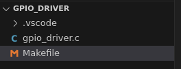

## GPIO Linux Driver實作

**Accessing the GPIO in Linux Kernel**

網路上有很多教學多說: `sudo apt install raspberrypi-kernel-headers` 就可以開發代碼並撰寫Makefile了，但是我遇到了好多坑。 如該[網站1](https://embetronicx.com/tutorials/linux/device-drivers/gpio-driver-basic-using-raspberry-pi/)所描述，已經不適合我的`uname -r`了。[網站1](https://embetronicx.com/tutorials/linux/device-drivers/gpio-driver-basic-using-raspberry-pi/)的範例為Kernel version為5.1.*，

所以要使用原碼編譯的方式。完成`raspberrypi-kernel-headers`的正確版本安裝。

查看自身樹莓派的kernel版本，輸入指令`uname -r`

```makefile
> uname -r
6.6.34-v8+
```

所以在之後的步驟當中，我需要從官方網站: https://github.com/raspberrypi/linux.git當中git cone下來後，切換分支到`rpi-6.6.y`

我的步驟:

1. Clone the Kernel Source

```bash
cd /usr/src/
git clone --depth=1 --branch rpi-6.6.y https://github.com/raspberrypi/linux.git
cd linux

> git branch
* rpi-6.6.y
```

2. Configure the Kernel 安裝完源代碼之後開始進行編譯。

```bash
# Copy Default Configuration:
sudo cp arch/arm64/configs/bcm2711_defconfig .config

# Prepare the Kernel Build Environment:
sudo make bcm2711_defconfig
sudo make prepare
sudo make modules_prepare

# 可以產Module.symvers : 這個指令要跑超級久，可以選擇先忽略。跑了也好，一整天沒了。
# 我自己有跑這個指令，所以我跑完之後有備份整個樹莓派。以防萬一。
sudo make modules -j 4 
```

3. Build and Install Kernel Headers

```bash
sudo make headers_install INSTALL_HDR_PATH=/usr/src/linux-headers-6.6.34-v8+
```

1. Build Your Kernel Module

編寫`gpio_driver.c`和`Makefile`

Create a new file, for example, `gpio_driver.c`

```bash
# 新建專案位置
cd Desktop
mkdir twinkle_led
cd twinkle_led
mkdir gpio_driver
cd gpio_driver
nano gpio_driver.c
```

將下列代碼輸入

```c
#include <linux/module.h>
#include <linux/gpio.h>
#include <linux/gpio/consumer.h>
#include <linux/fs.h>
#include <linux/uaccess.h>
#include <linux/of.h>
#include <linux/of_device.h>
#include <linux/platform_device.h>

#define DEVICE_NAME "gpio_driver"

static int major_number;
static struct gpio_desc *gpio_desc;
static int gpio_state = 0;
static int device_open(struct inode *, struct file *);
static int device_release(struct inode *, struct file *);
static ssize_t device_write(struct file *, const char __user *, size_t, loff_t *);

static struct file_operations fops = {
    .open = device_open,
    .release = device_release,
    .write = device_write,
};
static int gpio_probe(struct platform_device *pdev)
{
    int result;
    struct device *dev = &pdev->dev;

    printk(KERN_INFO "GPIO_DRIVER: Probing the GPIO driver\n");

    gpio_desc = devm_gpiod_get(dev, NULL, GPIOD_OUT_LOW);
    if (IS_ERR(gpio_desc)) {
        printk(KERN_ERR "GPIO_DRIVER: Failed to get GPIO descriptor\n");
        return PTR_ERR(gpio_desc);
    }
    printk(KERN_INFO "GPIO_DRIVER: GPIO descriptor obtained\n");

    result = gpiod_direction_output(gpio_desc, 0);
    if (result) {
        printk(KERN_ERR "GPIO_DRIVER: Failed to set GPIO direction\n");
        return result;
    }
    printk(KERN_INFO "GPIO_DRIVER: GPIO direction set to output\n");

    return 0;
}
// static int gpio_probe(struct platform_device *pdev) {
//     int result;
//     struct device *dev = &pdev->dev;

//     printk(KERN_INFO "GPIO_DRIVER: Probing the GPIO driver\n");

//     gpio_desc = devm_gpiod_get(dev, "gpio17", GPIOD_OUT_LOW);
//     if (IS_ERR(gpio_desc)) {
//         printk(KERN_ERR "GPIO_DRIVER: Failed to get GPIO descriptor\n");
//         return PTR_ERR(gpio_desc);
//     }
//     printk(KERN_INFO "GPIO_DRIVER: GPIO descriptor obtained\n");

//     result = gpiod_direction_output(gpio_desc, 0);
//     if (result) {
//         printk(KERN_ERR "GPIO_DRIVER: Failed to set GPIO direction\n");
//         return result;
//     }
//     printk(KERN_INFO "GPIO_DRIVER: GPIO direction set to output\n");

//     return 0;
// }

static int gpio_remove(struct platform_device *pdev) {
    gpiod_put(gpio_desc);
    return 0;
}

static const struct of_device_id gpio_of_match[] = {
    { .compatible = "gpio-leds" },
    {},
};
MODULE_DEVICE_TABLE(of, gpio_of_match);

static struct platform_driver gpio_driver = {
    .driver = {
        .name = DEVICE_NAME,
        .of_match_table = gpio_of_match,
    },
    .probe = gpio_probe,
    .remove = gpio_remove,
};

static int __init gpio_driver_init(void) {
    int result;

    printk(KERN_INFO "GPIO_DRIVER: Initializing the GPIO driver\n");

    result = platform_driver_register(&gpio_driver);
    if (result) {
        printk(KERN_ERR "GPIO_DRIVER: Failed to register platform driver\n");
        return result;
    }

    major_number = register_chrdev(0, DEVICE_NAME, &fops);
    if (major_number < 0) {
        printk(KERN_ALERT "GPIO_DRIVER: Failed to register a major number\n");
        platform_driver_unregister(&gpio_driver);
        return major_number;
    }
    printk(KERN_INFO "GPIO_DRIVER: Registered correctly with major number %d\n", major_number);

    return 0;
}

static void __exit gpio_driver_exit(void) {
    printk(KERN_INFO "GPIO_DRIVER: Exiting the GPIO driver\n");
    unregister_chrdev(major_number, DEVICE_NAME);
    platform_driver_unregister(&gpio_driver);
    printk(KERN_INFO "GPIO_DRIVER: Goodbye from the LKM!\n");
}

static int device_open(struct inode *inodep, struct file *filep) {
    printk(KERN_INFO "GPIO_DRIVER: Device has been opened\n");
    return 0;
}

static int device_release(struct inode *inodep, struct file *filep) {
    printk(KERN_INFO "GPIO_DRIVER: Device successfully closed\n");
    return 0;
}

static ssize_t device_write(struct file *filep, const char __user *buffer, size_t len, loff_t *offset) {
    char buf;
    if (copy_from_user(&buf, buffer, 1)) {
        return -EFAULT;
    }
    printk(KERN_INFO "GPIO_DRIVER: Received write: %c\n", buf);

    if (buf == '1') {
        gpiod_set_value(gpio_desc, 1);
        gpio_state = 1;
        printk(KERN_INFO "GPIO_DRIVER: GPIO set to high\n");
    } else if (buf == '0') {
        gpiod_set_value(gpio_desc, 0);
        gpio_state = 0;
        printk(KERN_INFO "GPIO_DRIVER: GPIO set to low\n");
    } else {
        printk(KERN_INFO "GPIO_DRIVER: Invalid value\n");
        return -EINVAL;
    }
    return len;
}

MODULE_LICENSE("GPL");
MODULE_AUTHOR("Your Name");
MODULE_DESCRIPTION("A simple Linux char driver for GPIO control");
MODULE_VERSION("0.1");

module_init(gpio_driver_init);
module_exit(gpio_driver_exit);

```

新增並編寫Makefile，原本網站的教程如下:

```makefile
obj-m += gpio_driver.o
all:
    make -C /lib/modules/$(shell uname -r)/build M=$(PWD) modules
clean:
    make -C /lib/modules/$(shell uname -r)/build M=$(PWD) clean
```

實際的Makefile

```makefile
obj-m += gpio_driver.o
# KERNELDIR ?= /usr/src/linux-headers-6.6.34-v8+
KERNELDIR ?= /usr/src/linux  # 源碼編譯的目錄

PWD := $(shell pwd)

# Add standard include paths
# EXTRA_CFLAGS += -I/usr/include
EXTRA_CFLAGS += -I/usr/include -I/usr/src/linux-headers-6.6.34-v8+/include

all:
	make -C $(KERNELDIR) M=$(PWD) KBUILD_MODPOST_WARN=1 modules

clean:
	make -C $(KERNELDIR) M=$(PWD) clean

```

目前成果:



4.1 Revisiting the **Driver** and **Device Tree Configuration**(重新審視驅動程式和裝置樹配置)

確保**裝置樹**覆蓋正確定義和編譯。於是創建一個`my_gpio17.dts`文件(device tree source)，並輸入以下內容:

```bash
/dts-v1/;
/plugin/;

/ {
    compatible = "brcm,bcm2711";  // 這裡要看樹莓派的SOC

    fragment@0 {
        target = <&gpio>;
        __overlay__ {
            my_gpio17: my_gpio17 {
                compatible = "gpio-leds";
                pinctrl-names = "default";
                gpios = <&gpio 17 0>;  // 0 for active high, 1 for active low
                linux,default-trigger = "none";
            };
        };
    };
};
```

編譯設備樹(.dts)並複製overlay：

```bash
# 該指令成功不會有任何信息，錯誤會有錯誤信息。
dtc -@ -I dts -O dtb -o my_gpio17.dtbo my_gpio17.dts

sudo cp my_gpio17.dtbo /boot/overlays/
```

我們可以看到`/boot/overlays/` 是一個softlink，他連結到`/boot/firmware/overlays/`


Add the overlay to `config.txt`:

```bash
~~ sudo nano /boot/config.txt ~~
sudo nano /boot/firmware/config.txt

# 將下面的內容貼上到[all]的下面。
dtoverlay=my_gpio_driver
```

完成之後重啟。

```bash
sudo reboot
```

---

另外要開啟樹莓派的遠端gpio存取。

```bash
sudo raspi-config
```


啟動Remote GPIO 


---

最後可以又回到Load Modules指令:

```bash
make clean
make
# Unload the existing module:
sudo rmmod gpio_driver
# Insert the module into the kernel (**加載驅動程序**)
sudo insmod gpio_driver.ko
# Verify that the module is loaded:
lsmod | grep gpio_driver
```


5. Check Device Tree Overlay:

After rebooting, verify the overlay has been applied:

`<sudo insmod gpio_driver.ko>`**出現錯誤的話，下面指令會可以查看gpio_driver.c裡面打印出的資訊。知道哪部分出錯。**

```makefile
dmesg | grep -i gpio  
```

上面有提到Registered correctly with major number **236**

所以下面的major_number改成236。

6. 創建設備節點

```bash
> sudo mknod /dev/gpio_driver c <major_number> 0
> sudo mknod /dev/gpio_driver c 236 0
> sudo chmod 666 /dev/gpio_driver　#更改權限
> ls -l /dev/gpio_driver  #查看權限
crw-rw-rw- 1 root root 236, 0 Jun 25 10:13 /dev/gpio_driver
```

7. Testing the Driver

樹莓派原本自己就有gpio的驅動，上面的都是我們的客製化行為。

以拉高與拉低gpio 17 為例子。

```bash
> sudo raspi-gpio get 17
GPIO 17: level=0 func=INPUT pull=DOWN
> echo 529 > /sys/class/gpio/export  # 512 + 17
> echo out > /sys/class/gpio/gpio529/direction
> sudo raspi-gpio get 17
GPIO 17: level=0 func=OUTPUT pull=DOWN
> echo 1 | sudo tee /sys/class/gpio/gpio529/value
> echo 0 | sudo tee /sys/class/gpio/gpio529/value
> echo 529 > /sys/class/gpio/unexport
```

使用客製化驅動，操控GPIO。就是本實驗客製化gpio驅動的成果。

```bash

echo 1 | sudo tee /dev/gpio_driver  # Set GPIO high
echo 0 | sudo tee /dev/gpio_driver  # Set GPIO low
```

現在您可以使用標準文件操作與驅動程式互動。